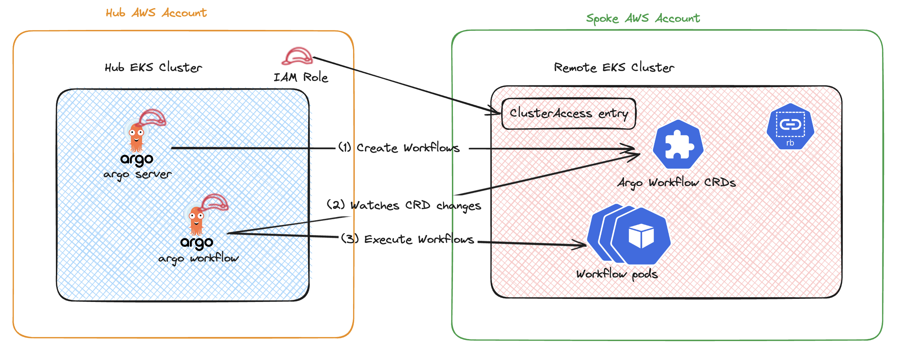

# Cross EKS Cluster Execution of Argo Workflows

In this walkthrough, we will explore how to run argo-workflow-controller in a hub EKS cluster and execute the actual workflows in a spoke EKS cluster. These two eks clusters are deployed to different AWS Accounts and we will utilize IAM Roles and EKS Pod Identity for authentication.

In this approach, entire workflow is executed in the spoke cluster. argo-workflow-controller deployed to hub cluster watches for workflow CRD changes in the spoke cluster and launch k8s pods to execute the various steps.



### Prerequisites

- Install the `eksctl`
- 2 AWS Accounts
- AWS CLI profiles setup for both AWS Accounts
- Setup the env variables
```bash
export AWS_REGION=us-west-2
export EKS_HUB_CLUSTER=ekshub
export EKS_SPOKE_CLUSTER=eksSPOKE
export EKS_HUB_ACCOUNT=112233445566
export EKS_SPOKE_ACCOUNT=998877665544
```

### Step 1: Create EKS Cluster in the hub AWS Account

Create a hub EKS cluster with default configuration

```bash
eksctl create cluster --name $EKS_HUB_CLUSTER --region $AWS_REGION --profile hub-profile
.......
[✔]  EKS cluster "ekshub" in "us-west-2" region is ready

aws eks update-kubeconfig --name $EKS_HUB_CLUSTER --region $AWS_REGION --alias $EKS_HUB_CLUSTER --profile hub-profile
```

### Step 2: Create EKS Cluster in the spoke AWS Account

Create a spoke EKS cluster with default configuration in same or different AWS Account

```bash
eksctl create cluster --name $EKS_SPOKE_CLUSTER --region $AWS_REGION --profile spoke-profile
.......
[✔]  EKS cluster "eksspoke" in "us-west-2" region is ready

aws eks update-kubeconfig --name $EKS_SPOKE_CLUSTER --region $AWS_REGION --alias $EKS_SPOKE_CLUSTER --profile spoke-profile
```

Wait for the cluster messages as shown above and proceed with next steps.

### Step 3: Create custom images of Argo Workflows and Argo Server as they require AWS CLI to interact with spoke EKS clusters

Create a new Argo Workflow container image with AWS CLI

```bash
cat << EOF > DockerfileArgow
FROM quay.io/argoproj/workflow-controller:v3.5.5 as argow

FROM public.ecr.aws/aws-cli/aws-cli:2.15.33

COPY --from=argow /etc/ssh/ssh_known_hosts /etc/ssh/
COPY --from=argow /etc/nsswitch.conf /etc/

COPY --from=argow /bin/workflow-controller /bin/

ENTRYPOINT [ "workflow-controller" ]
EOF

docker build -t sriram430/workflow-controller-aws:v3.5.5 -f DockerfileArgow .

docker push sriram430/workflow-controller-aws:v3.5.5
```

Create a new Argo Server container image with AWS CLI

```bash
cat << EOF > DockerfileArgoServer
FROM quay.io/argoproj/argocli:v3.5.5 as argocli

FROM public.ecr.aws/aws-cli/aws-cli:2.15.33

COPY --from=argocli /etc/ssh/ssh_known_hosts /etc/ssh/
COPY --from=argocli /etc/nsswitch.conf /etc/

COPY --from=argocli /bin/argo /bin/

ENTRYPOINT [ "argo" ]
EOF

docker build -t sriram430/argocli-aws:v3.5.5 -f DockerfileArgoServer .

docker push sriram430/argocli-aws:v3.5.5
```

### Step 4: Create an IAM role for the hub cluster to authenticate with spoke cluster

```bash
aws iam create-policy \
    --policy-name AmazonEKSReadPolicy \
    --profile hub-profile \
    --policy-document \
'{
    "Version": "2012-10-17",
    "Statement": [
        {
            "Sid": "VisualEditor0",
            "Effect": "Allow",
            "Action": [
                "eks:AccessKubernetesApi",
                "eks:DescribeCluster"
            ],
            "Resource": "*"
        }
    ]
}'
```

```bash

eksctl create addon --name eks-pod-identity-agent \
--cluster $EKS_HUB_CLUSTER --region $AWS_REGION \
--profile hub-profile

eksctl create podidentityassociation \
--cluster $EKS_HUB_CLUSTER \
--namespace argo \
--service-account-name argo \
--role-name eks-hub-cluster-role \
--permission-policy-arns arn:aws:iam::${EKS_HUB_ACCOUNT}:policy/AmazonEKSReadPolicy \
--region $AWS_REGION \
--profile hub-profile

eksctl create podidentityassociation \
--cluster $EKS_HUB_CLUSTER \
--namespace argo \
--service-account-name argo-server \
--role-arn arn:aws:iam::${EKS_HUB_ACCOUNT}:role/eks-hub-cluster-role \
--region $AWS_REGION \
--profile hub-profile
```

### Step 5: Create a cluster access entry for the Hub Cluster's IAM role in the spoke EKS cluster

*For testing purposes we are using AmazonEKSClusterAdminPolicy, scope down these permissions based on argo-workflow requirements.*

```bash
aws eks create-access-entry --cluster-name $EKS_SPOKE_CLUSTER --principal-arn arn:aws:iam::${EKS_HUB_ACCOUNT}:role/eks-hub-cluster-role \
    --profile spoke-profile --region $AWS_REGION

aws eks associate-access-policy --cluster-name $EKS_SPOKE_CLUSTER --principal-arn arn:aws:iam::${EKS_HUB_ACCOUNT}:role/eks-hub-cluster-role \
    --access-scope type=cluster --policy-arn arn:aws:eks::aws:cluster-access-policy/AmazonEKSClusterAdminPolicy \
    --profile spoke-profile --region $AWS_REGION
```

### Step 6: Create the Argo Workflows CRDs, Service Account, Roles, Role Bindings in spoke EKS cluster

```bash
kubectl apply -f https://raw.githubusercontent.com/ashoksrirama/argo-workflows-demo/main/argo-workflows-spoke.yaml --context $EKS_SPOKE_CLUSTER
```

### Step 7: Create a k8s secret in hub cluster with kubeconfig file of spoke cluster

```bash
# Create the kubeconfig file of the spoke cluster
aws eks update-kubeconfig --name $EKS_SPOKE_CLUSTER --region $AWS_REGION --profile spoke-profile --kubeconfig spoke-kubeconfig

export KUBECONFIG_SPOKE=$(head -n -3 spoke-kubeconfig) #If fails, replace head with ghead

# Create namespace
kubectl create namespace argo --context $EKS_HUB_CLUSTER

# Create k8s secret with spoke cluster's kubeconfig
kubectl create secret generic spoke-kubeconfig --from-literal kubeconfig=$KUBECONFIG_SPOKE -n argo --context $EKS_HUB_CLUSTER
```

### Step 8: Install the Argo Workflow Controller and Argo Server in the Hub EKS cluster

```bash
# Replace ARGO_WORKFLOWS_VERSION with latest Argo Workflows version
kubectl apply -f https://github.com/argoproj/argo-workflows/releases/download/v<<ARGO_WORKFLOWS_VERSION>>/install.yaml --context $EKS_HUB_CLUSTER
```

### Step 9: Patch argo-server authentication

```bash
cat << EOF > argo-server-patch.yaml
spec:
  template:
    spec:
      containers:
      - name: argo-server
        image: sriram430/argocli-aws:v3.5.5 #replace with your image
        args:
        - server
        - '--auth-mode=server'
        - '--loglevel=debug' #setup loglevel
        - '--kubeconfig=/kube/config/kubeconfig'
        volumeMounts:
        - name: spoke-kubeconfig
          mountPath: /kube/config
        securityContext:
          capabilities:
          runAsNonRoot: false
          readOnlyRootFilesystem: false
          allowPrivilegeEscalation: false
      volumes:
      - name: spoke-kubeconfig
        secret:
          secretName: spoke-kubeconfig
EOF

kubectl patch deployment -n argo argo-server --patch-file argo-server-patch.yaml --context $EKS_HUB_CLUSTER
```

### Step 10: Patch argo-workflow controller

```bash
cat << EOF > workflow-controller-patch.yaml
spec:
  template:
    spec:
      containers:
      - name: workflow-controller
        image: sriram430/workflow-controller-aws:v3.5.5 #replace with your image
        command:
        - workflow-controller
        - '--loglevel=debug' #setup loglevel
        - '--kubeconfig=/kube/config/kubeconfig'
        volumeMounts:
        - name: spoke-kubeconfig
          mountPath: /kube/config
        securityContext:
          capabilities:
          runAsNonRoot: false
          readOnlyRootFilesystem: false
          allowPrivilegeEscalation: false
      volumes:
      - name: spoke-kubeconfig
        secret:
          secretName: spoke-kubeconfig
EOF

kubectl patch deployment -n argo workflow-controller --patch-file workflow-controller-patch.yaml --context $EKS_HUB_CLUSTER
```

### Step 11: Confirm the pods are up and running

```bash
kubectl get pods -n argo --context $EKS_HUB_CLUSTER
```

```output
NAME                                  READY   STATUS    RESTARTS   AGE
argo-server-56547dc758-842v5          1/1     Running   0          4m13s
workflow-controller-c699d6f49-9vc5j   1/1     Running   0          108s
```

### Step 12: Submit a sample workflow in Spoke EKS Cluster

```bash
cat << EOF > hello-workflow.yaml
apiVersion: argoproj.io/v1alpha1
kind: Workflow                  # new type of k8s spec
metadata:
  generateName: hello-world-    # name of the workflow spec
spec:
  entrypoint: whalesay          # invoke the whalesay template
  templates:
    - name: whalesay              # name of the template
      container:
        image: docker/whalesay
        command: [ cowsay ]
        args: [ "hello world" ]
        resources: # limit the resources
          limits:
            memory: 32Mi
            cpu: 100m
EOF

kubectl create -f hello-workflow.yaml --context $EKS_SPOKE_CLUSTER
```

### Step 13: Verify the workflow execution

```bash
kubectl get pods --context $EKS_SPOKE_CLUSTER
```

```output
NAME                READY   STATUS      RESTARTS   AGE
hello-world-klhjq   0/2     Completed   0          97s
```

YaY, we completed the walkthrough of running argo-workflow controller in Hub EKS cluster and actual workflow executions in a spoke EKS cluster.
