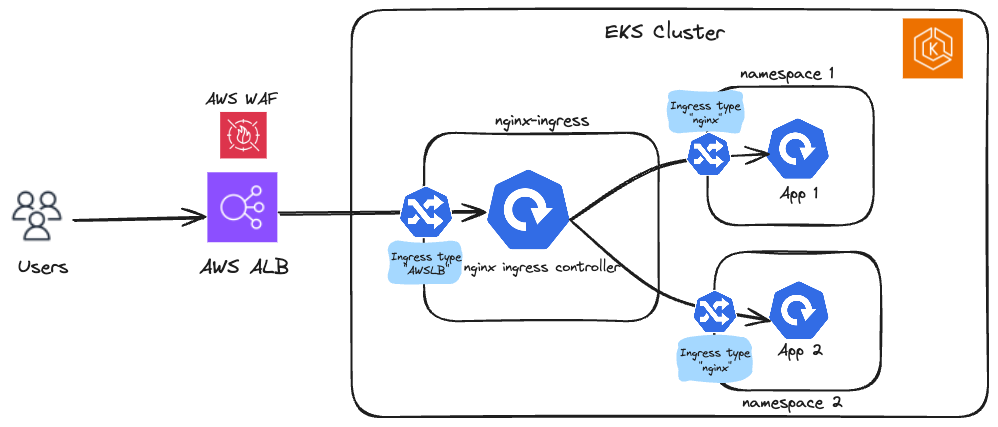

# Nginx Ingress Controller

In this walkthrough, we will use two ingress controllers setup in our Amazon EKS cluster. Nginx ingress is used to expose all applications running in the cluster and nginx ingress controller itself is exposed via AWS Application LoadBalancer (Ingress resource) by AWS LB controller. By doing this, you can attach AWS Web Application Firewall (AWS WAF) on the ALB to get protection against Layer 7 attacks, and overcome the hard limits of AWS ALB (such as 100 target groups per ALB, etc.,).




### Prerequisites

- Install the `eksctl`

Create a basic cluster with default configuration

```bash
eksctl create cluster --name eksdemo --region us-west-2
.......
[✔]  EKS cluster "eksdemo" in "us-west-2" region is ready
```

Wait for the cluster message as shown above and export the following `env` variables.

```bash
export AWS_REGION=us-west-2
export EKS_CLUSTER=eksdemo
```

### Step 1: Install AWS LB Controller to create AWS ELB resources for k8s ServiceType `LoadBalancer` and Ingress resources

Follow the instructions [here](https://docs.aws.amazon.com/eks/latest/userguide/lbc-helm.html) to install the AWS LB controller addon on the EKS cluster.

Validate the deployment after the installation

```bash
kubectl get deployment -n kube-system aws-load-balancer-controller
```

```output
NAME                           READY   UP-TO-DATE   AVAILABLE   AGE
aws-load-balancer-controller   2/2     2            2           84s
```

### Step 2: Install the nginx-ingress controller

We are installing the nginx-ingress controller on the cluster and exposing it internally via `ClusterIP` service. 

```bash
helm install my-nginx ingress-nginx/ingress-nginx \
--namespace nginx-ingress \
--set controller.service.type=ClusterIP \
--create-namespace
```


### Step 3: Expose the nginx-ingress controller via AWS Application LoadBalancer

:::warning
In the below example, only port `80` is exposed via ALB. Its highly recommended to use https (443) along with a SSL certificate from AWS Certificate Manager.
:::

```bash
cat <<EOF | kubectl apply -f -
apiVersion: networking.k8s.io/v1
kind: Ingress
metadata:
  namespace: nginx-ingress
  name: ingress-nginx-controller
  annotations:
    alb.ingress.kubernetes.io/scheme: internet-facing
    alb.ingress.kubernetes.io/target-type: ip
    alb.ingress.kubernetes.io/target-group-attributes: deregistration_delay.timeout_seconds=10
    alb.ingress.kubernetes.io/healthcheck-path: /healthz
spec:
  ingressClassName: alb
  rules:
    - http:
        paths:
        - path: /
          pathType: Prefix
          backend:
            service:
              name: my-nginx-ingress-nginx-controller
              port:
                number: 80

EOF
```

wait for the ALB creation, nginx-ingress pod registration to complete. And grab the ALB dns name from the below command:

```bash
kubectl get ingress -n nginx-ingress
```

```output
NAME                       CLASS   HOSTS   ADDRESS                                                                   PORTS   AGE
ingress-nginx-controller   alb     *       k8s-nginxing-ingressn-af3887fb52-1426628659.us-west-2.elb.amazonaws.com   80      2m
```

### Step 4: Deploy sample application and exposed via nginx ingress


```bash
cat <<EOF | kubectl apply -f -
apiVersion: apps/v1 
kind: Deployment 
metadata:
  name: httpd-app
  namespace: default 
spec:
  replicas: 2
  selector:
    matchLabels:
      app: httpd-app
  template:
    metadata:
      labels:
        app: httpd-app
    spec:
      containers:
      - name: httpd-app
        image: httpd:latest
        ports:
        - containerPort: 80 

--- 
apiVersion: v1 
kind: Service 
metadata:
  name: httpd-app-svc
  namespace: default
spec:
  ports:
  - port: 80
    targetPort: 80
    protocol: TCP
  selector:
    app: httpd-app

---
apiVersion: networking.k8s.io/v1 
kind: Ingress 
metadata:
  name: httpd-app-ingress
  namespace: default
  annotations:
    nginx.ingress.kubernetes.io/rewrite-target: /
spec:
  ingressClassName: nginx
  rules:
    - http:
        paths:
        - backend:
            service:
              name: httpd-app-svc
              port:
                number: 80
          path: /httpd
          pathType: Prefix
EOF
```

```output
deployment.apps/httpd-app created
service/httpd-app-svc created
ingress.networking.k8s.io/httpd-app-ingress created
```

Step 5: Test the setup

Access the sample `httpd` application using ALB Ingress url (from Step 3)

```curl
curl http://k8s-nginxing-ingressn-af3887fb52-1426628659.us-west-2.elb.amazonaws.com/httpd
```

```output
<html><body><h1>It works!</h1></body></html>
```

YaY! We successfully validated two ingress controllers setup in our Amazon EKS cluster.
